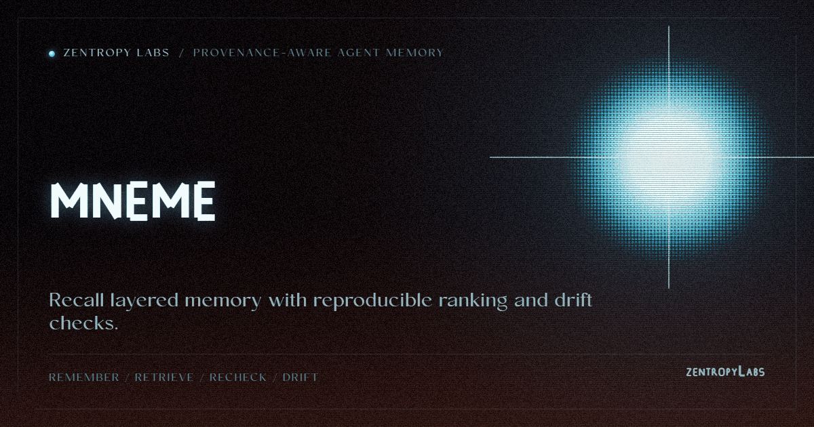

<p align="center"></p>

# mneme

> Accountable agent memory. The layered memory and hybrid retrieval agents
> expect, plus the three things no other memory system ships: every memory
> carries its provenance, every recall reproduces its ranking, and every stale
> memory flags its own drift.

**Install today** (PyPI release imminent):

```bash
pip install git+https://github.com/HarperZ9/mneme.git
```

Zero runtime dependencies · fully local · deterministic · MIT.

## Why another memory library

Agent memory systems store facts and hand them back. None of them can answer two
questions a serious deployment must ask:

- **Why did you recall *this* memory?** Their ranking is a black box.
- **Is this memory still true to its source?** They keep a fact after its source
  changed and you find out when the agent acts on stale information.

mneme answers both, because every operation emits a re-checkable receipt.

## The 4-tier memory (on par with the category)

```
L0 turn      raw dialogue                 -> stored verbatim
L1 atom      atomic user facts            -> extracted, each bound to its turn
L2 scenario  scene blocks of related atoms
L3 persona   the user profile             -> synthesized, citing its atoms
```

Retrieval is hybrid: BM25 (pure Python, always on) fused with an optional
embedding channel by Reciprocal Rank Fusion: the same keyword / semantic /
hybrid surface the leaders offer, with no required embedding API.

## What only mneme does

**A recall you can re-derive.** Every `recall` returns a receipt with the ranked
hits, their BM25 and vector scores, and the exact fusion rule. And `verify_recall`
ships the check: it re-runs the scorer over the same rows and confirms the ranking,
so a fabricated or tampered recall is caught even if its definition hash still
matches, and a store that changed no longer reproduces. The recall is auditable by a
function you can put in CI, not a claim you take on faith.

```python
from mneme import recall, verify_recall

r = recall("deploy steps", rows, strategy="hybrid", embedder=embed)
assert verify_recall(r, rows, embedder=embed)   # re-derived from the store, not trusted
```

```bash
mneme remember alice session.json
mneme recall "where does the user live" --json
# -> {"schema":"mneme.recall/1","hits":[{"memory_id":"…","bm25":2.14,"fused":…}],
#     "recheck":"mneme recall --query Q --state DB  (re-run the scorer, reproduce the ranking)"}
```

**A memory that flags its own staleness.** `drift` re-derives every memory's
grounding against the current store: `MATCH` (source present and unchanged),
`DRIFT` (a source changed under the memory), `UNVERIFIABLE` (a source is gone).

```bash
mneme drift            # -> {"overall":"DRIFT","drifted":["…"], …}  exit 1 on drift
```

**Provenance on every memory.** Every atom names the turn it came from, the
extractor, the criterion, and a content hash. The persona is not free text: it
cites its atoms, so it is drift-checkable too.

## Library

```python
from mneme import AgentMemory

mem = AgentMemory("mem.db")                       # or ":memory:"
mem.remember("alice", [{"role": "user", "text": "I live in Denver and love dark roast."}])

receipt = mem.recall("coffee preference")         # RecallReceipt, re-derivable
print(mem.drift()["overall"])                     # MATCH until a source changes
```

An embedder (`AgentMemory(..., embedder=fn)`) turns on the vector channel; an
LLM `Extractor` plugs in for richer atoms. Neither is required: the
deterministic floor works with no model and no API.

## The ecosystem: memory that traces to its source

Point mneme at an accountable intake tool ([gather](https://github.com/HarperZ9/gather),
the sibling flagship) and the provenance chains end to end, something no
single-purpose memory library can do:

```
web url --(gather sha256)--> mneme turn --> mneme atom --> recall
```

```bash
mneme ingest research items.json     # gather-shaped {id,text,source,ref,method,sha256}
mneme recall "where is the user based"
mneme chain <memory_id>              # -> the web url + content hash it came from
```

An agent that remembers what it researched, and can prove a recalled memory
traces to the exact bytes fetched from the exact source (`re-fetch the ref,
re-hash, confirm it equals the origin sha256`). Any intake tool that emits that
shape composes; mneme never imports gather.

And the loop closes at the other end. `mneme to-crucible` emits a schema-v2
[crucible](https://github.com/HarperZ9/crucible) export: each memory is a claim
paired with Mneme's source-bound drift measurement. Crucible independently
recomputes and seals `MATCH`, `DRIFT`, or `UNVERIFIABLE` from that measurement.
Each exported measurement now carries a declarative `mneme.recheck/1`
descriptor. After Crucible writes an assessment-bound replay template, Mneme
can re-read the supplied state and fill its replay pack without importing
Crucible or embedding a database path or executable command in the descriptor:

```bash
crucible recheck REGISTRY --template replay-template.json
mneme --state mneme.db replay-crucible replay-template.json --out replay-pack.json
crucible recheck REGISTRY --pack replay-pack.json --json
```

The replay command fails closed when the assessment triple, claim binding,
descriptor, original measurement contract, or target memory grounding differs.
Ordinary source drift remains a replay result (`1.0`); a missing source remains
unverifiable (`null`). Crucible still does not independently re-read Mneme's
source—the source recheck is Mneme-owned and Crucible verifies that the replayed
measurement exactly reproduces its sealed contract.

The command consumes `crucible.replay-template/1`, opens the supplied SQLite
state read-only, verifies and preserves the compact descriptor-only
`crucible.replay-set/1` binding, and emits `crucible.replay-pack/1`. The binding
records descriptor and skipped-row counts without disclosing descriptorless
assessment rows. Historical schema-less templates remain compatible only when
they have no replay binding and their complete measurement seal reproduces;
bound templates require the canonical schema. Read-only schema compatibility is
checked without migration, and a completed, synced pack is published atomically
without overwriting an existing path. Malformed provenance is rejected before
descriptor or pack creation; replay never rewrites the evidence database.

```
gather (intake) --> mneme (drift + replay) --> crucible (sealed recomputation)
```

The export keeps measurement and assessment separate without claiming independent
source certification.

## Accountable forgetting

Every memory system lets you delete a fact. mneme is the only one where the
deletion is auditable: `forget` and `update` leave a hash-chained tombstone,
what was forgotten, its hash, and why, so you cannot quietly forget that you
forgot something (required for GDPR-style "right to be forgotten" you can prove).

```bash
mneme forget <memory_id> --reason "user requested deletion"
mneme audit          # -> {"entries":1,"chain_intact":true,"log":[{"op":"forget", …}]}
```

`update` edits a memory's text while keeping its provenance and recording the
before/after hash. Tamper a tombstone and the chain breaks.

## Agents plug in over MCP

```bash
mneme mcp          # JSON-RPC 2.0 over stdio; MNEME_STATE points at the DB
```

Tools: `mneme.remember`, `mneme.recall`, `mneme.drift`, `mneme.provenance`. A
recall through MCP returns the same re-derivable receipt, so the agent (or its
operator) can see and re-check why a memory was surfaced; the accountability
travels with the tool result.

## Benchmark you can re-run

The category is sold on one number: "N% fewer tokens." Everyone publishes the
reduction; nobody proves the answer *survived* it. mneme measures both.

```bash
mneme bench
# token_reduction: 76.6%   (full history 125 tok -> avg recalled 29 tok)
# answer_recall:   100%    (5 probes, every needed fact survived the reduction)
```

A reduction is only reported **alongside** its answer recall, so a number that
looks great by forgetting the answer is disqualified, not a win. The receipt
carries the per-probe detail and the exact token estimator, so a third party
re-runs the measurement over the same conversation and reproduces the number,
a benchmark you can escrow, not a marketing figure. Point it at your own
conversation with `--turns convo.json --probes probes.json`.

## Scenarios (L2)

```bash
mneme scenarios alice     # cluster the session's atoms into scene blocks
```

Atoms sharing a theme cluster deterministically into L2 scenarios; each scenario
cites its atoms, so it is drift-checkable too (a scenario whose atom is gone is
`UNVERIFIABLE`, never silently kept).

## Guarantees

- **Zero runtime dependencies** (stdlib `sqlite3`). `pytest` is the only dev dep.
- **Deterministic.** No wall clock or randomness enters a stored hash or a
  ranking; the same turns rebuild the same memory, byte for byte.
- **Tests are the contract.** Every behavior above ships with a falsifier.

## License

MIT.

## What this believes

This tool is one lane of a family that holds a single belief steady across
every surface: knowledge open to anyone who can attain the means; acceptance
decided by external checks, never reputation; every result re-runnable;
honest nulls first-class; ownership earned by comprehension; learning woven
into the work. The full text lives in [CREDO.md](CREDO.md).
The long form of this belief: [The Unbundling](https://github.com/HarperZ9/flywheel/blob/fix/release-model-identity/docs/essays/2026-07-13-the-unbundling.md).

---

**[Zentropy Labs](https://github.com/ZentropyLabs-ai)** · order out of entropy. An independent lab building evidence-first tools that leave a re-checkable artifact behind. Built by Zain Dana Harper in Seattle. The full workbench is at [Project Telos](https://harperz9.github.io).
