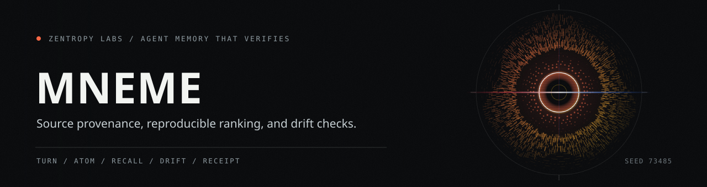

<p align="center"></p>

# mneme

> Accountable agent memory. Mneme records source provenance for stored
> memories, returns recall receipts that reproduce ranking, and detects source
> drift when checks run.

**Install from the versioned GitHub wheel after the v0.3.0 tag/release is published**:

```bash
python -m pip install "https://github.com/HarperZ9/mneme/releases/download/v0.3.0/mneme_memory-0.3.0-py3-none-any.whl"
```

For a source install from the current GitHub branch:

```bash
python -m pip install "mneme-memory @ git+https://github.com/HarperZ9/mneme.git"
```

Zero runtime dependencies · fully local · deterministic · fair-source.

## Why another memory library

Agent memory systems need evidence for two operational questions:

- **Why did you recall *this* memory?** Mneme returns the ranked hits, component
  scores, and fusion rule so the ranking can be reproduced.
- **Is this memory still grounded in its cited source?** Mneme records source
  hashes and re-checks them to detect drift, missing sources, or unverifiable
  grounding.

Mneme stores that evidence with the memory workflow instead of leaving it as a
separate operator note.

## The 4-tier memory model

```
L0 turn      raw dialogue                 -> stored verbatim
L1 atom      atomic user facts            -> extracted, each bound to its turn
L2 scenario  scene blocks of related atoms
L3 persona   the user profile             -> synthesized, citing its atoms
```

Retrieval is hybrid: BM25 (pure Python, always on) fused with an optional
embedding channel by Reciprocal Rank Fusion, with no required embedding API.

<p align="center"></p>

## Accountability features

**A recall you can re-derive.** Every `recall` returns a receipt with the ranked
hits, their BM25 and vector scores, and the exact fusion rule. And `verify_recall`
ships the check: it re-runs the scorer over the same rows and confirms the ranking,
so a fabricated or tampered recall is caught even if its definition hash still
matches, and a store that changed no longer reproduces. The recall is auditable by a
function you can put in CI, not a claim you take on faith.

```python
from mneme import recall, verify_recall

r = recall("deploy steps", rows, strategy="hybrid", embedder=embed)
assert verify_recall(r, rows, embedder=embed)   # re-derived from the store, not trusted
```

```bash
mneme remember chat session.json --user alice
mneme recall "where does the user live" --user alice --json
# -> {"schema":"mneme.recall/1","hits":[{"memory_id":"…","bm25":2.14,"fused":…}],
#     "recheck":"mneme recall --query Q --state DB  (re-run the scorer, reproduce the ranking)"}
```

**A drift check for source changes.** `drift` re-derives every memory's
grounding against the current store: `MATCH` (source present and unchanged),
`DRIFT` (a source changed under the memory), `UNVERIFIABLE` (a source is gone).

```bash
mneme drift            # -> {"overall":"DRIFT","drifted":["…"], …}  exit 1 on drift
```

<p align="center"></p>

Two details make that verdict hard to fake. A memory row has to reproduce its own
content hash before any of its sources are looked at, which catches a direct edit
of the text, the source list, or the criterion. Each cited source is then re-hashed
from its actual fields rather than read back from the hash stored beside it,
because trusting that stored value would let someone edit the database directly,
leave a stale hash in place, and collect a `MATCH`. The check re-derives on both
sides before it will agree with itself.

The three verdicts are also ordered when they roll up across a store: any `DRIFT`
makes the whole report `DRIFT`, otherwise any `UNVERIFIABLE` makes it
`UNVERIFIABLE`, and only a clean sweep reports `MATCH`. That order fails closed. A
memory whose source has been deleted is never rounded up to a match on the grounds
that nothing contradicted it, so absence of evidence is reported as absence rather
than as agreement.

<p align="center"></p>

Nine conditions reach one of those three verdicts, and the drawing above
lists every one of them. Four resolve to `DRIFT` and four to
`UNVERIFIABLE`. Exactly one reaches `MATCH`, which is the shape of a check
that has to earn agreement rather than assume it.

**Provenance on every memory.** Every atom names the turn it came from, the
extractor, the criterion, and a content hash. The persona is not free text: it
cites its atoms, so it is drift-checkable too.

## Library

```python
from mneme import AgentMemory

mem = AgentMemory("mem.db")                       # or ":memory:"
mem.remember("chat", [{"role": "user", "text": "I live in Denver and love dark roast."}],
             user="alice")

receipt = mem.recall("coffee preference", user="alice")  # RecallReceipt, re-derivable
print(mem.drift()["overall"])                     # MATCH until a source changes
```

An embedder (`AgentMemory(..., embedder=fn)`) turns on the vector channel; an
LLM `Extractor` plugs in for richer atoms. Neither is required: the
deterministic floor works with no model and no API.

## The ecosystem: memory that traces to its source

Point mneme at an accountable intake tool ([gather](https://github.com/HarperZ9/gather),
the sibling flagship) and the provenance chain can run end to end:

```
web url --(gather sha256)--> mneme turn --> mneme atom --> recall
```

```bash
mneme ingest research items.json --user alice     # gather-shaped {id,text,source,ref,method,sha256}
mneme recall "where is the user based" --user alice
mneme chain <memory_id>              # -> the web url + content hash it came from
```

An agent that remembers what it researched, and can prove a recalled memory
traces to the exact bytes fetched from the exact source (`re-fetch the ref,
re-hash, confirm it equals the origin sha256`). Any intake tool that emits that
shape composes; mneme never imports gather. Named-user `remember` and Gather
ingest derive source turn IDs from the user, session, supplied item/turn ID, and
for Gather the origin hash. The shared default user keeps the legacy raw-ID
namespace, except new default-user writes cannot use Mneme's reserved internal
source ID prefix.

And the loop closes at the other end. `mneme to-crucible` emits a schema-v2
[crucible](https://github.com/HarperZ9/crucible) export: each memory is a claim
paired with Mneme's source-bound drift measurement. Crucible independently
recomputes and seals `MATCH`, `DRIFT`, or `UNVERIFIABLE` from that measurement.
Each exported measurement now carries a declarative `mneme.recheck/1`
descriptor. After Crucible writes an assessment-bound replay template, Mneme
can re-read the supplied state and fill its replay pack without importing
Crucible or embedding a database path or executable command in the descriptor:

```bash
crucible recheck REGISTRY --template replay-template.json
python -c "import sqlite3; s=sqlite3.connect('file:mneme.db?mode=ro', uri=True); d=sqlite3.connect('mneme-replay-snapshot.db'); s.backup(d); d.execute('PRAGMA journal_mode=DELETE'); d.close(); s.close()"
mneme --state mneme-replay-snapshot.db replay-crucible replay-template.json --out replay-pack.json
crucible recheck REGISTRY --pack replay-pack.json --json
```

The replay command fails closed when the assessment triple, claim binding,
descriptor, original measurement contract, or target memory grounding differs.
Ordinary source drift remains a replay result (`1.0`); a missing source remains
unverifiable (`null`). Crucible still does not independently re-read Mneme's
source. The source recheck is Mneme-owned, and Crucible verifies that the
replayed measurement exactly reproduces its sealed contract.

The command consumes `crucible.replay-template/1` from a caller-owned,
quiescent, single-link rollback-journal snapshot. The example uses SQLite's
backup API to materialize one; keep that file unchanged until replay returns.

Open the source read-only when you take that snapshot, exactly as the example
does. A read-write handle on a WAL database whose writer exited without a clean
close will recover and checkpoint it: measured on Windows, that rewrote the main
file and deleted both sidecars. The read-only handle leaves the main file and
the WAL byte-identical. It can still update the `-shm` index, because SQLite
readers coordinate through shared memory. Stop source writers first when even
that is unacceptable.

Replay refuses WAL, SHM, or journal sidecars and hardlink aliases, fingerprints
the source around a consistent private SQLite backup, and reads only that
process-owned copy in immutable mode. It then verifies and preserves the compact
descriptor-only
`crucible.replay-set/1` binding, and emits `crucible.replay-pack/1`. The binding
records descriptor and skipped-row counts without disclosing descriptorless
assessment rows. Historical schema-less templates remain compatible only when
they have no replay binding and their complete measurement seal reproduces;
bound templates require the canonical schema. Read-only schema compatibility is
checked without migration, and a completed, synced pack is published atomically
without overwriting an existing path. Output paths that alias the state database
or a standard SQLite sidecar are rejected. Malformed provenance is rejected
before descriptor or pack creation. Replay does not modify the supplied
snapshot or its sidecar namespace. Changes detected while the private copy is
created fail the handoff; later source changes cannot affect that copy.

Library callers use the same contract explicitly and always close the private
snapshot owner:

```python
memory = AgentMemory(
    "mneme-replay-snapshot.db",
    read_only=True,
    immutable_snapshot=True,
)
try:
    pack = memory.replay_crucible(template)
finally:
    memory.close()
```

```
gather (intake) --> mneme (drift + replay) --> crucible (sealed recomputation)
```

The export keeps measurement and assessment separate without claiming independent
source certification.

## Accountable forgetting

Mneme deletes facts with an audit trail: `forget` and `update` leave a
hash-chained tombstone, what was forgotten, its hash, and why, so the deletion
record remains reviewable for GDPR-style "right to be forgotten" workflows.

```bash
mneme forget <memory_id> --reason "user requested deletion"
mneme audit          # -> {"entries":1,"chain_intact":true,"log":[{"op":"forget", …}]}
```

`update` edits a memory's text while keeping its provenance and recording the
before/after hash. Tamper a tombstone and the chain breaks.

## Agents plug in over MCP

```bash
mneme mcp          # JSON-RPC 2.0 over stdio; MNEME_STATE points at the DB
```

Tools: `mneme.remember`, `mneme.recall`, `mneme.drift`, `mneme.provenance`. A
recall through MCP returns the same re-derivable receipt, so the agent (or its
operator) can see and re-check why a memory was surfaced; the accountability
travels with the tool result.

## Benchmark you can re-run

Token-reduction benchmarks are more useful when paired with answer-retention
checks. Mneme reports both for the included benchmark.

```bash
mneme bench
# token_reduction: 76.6%   (full history 125 tok -> avg recalled 29 tok)
# answer_recall:   100%    (5 probes, every needed fact survived the reduction)
```

The included reduction is reported **alongside** answer recall, so a run that
forgets required answers is visible in the result. The receipt carries the
per-probe detail and the exact token estimator, so a third party can re-run the
measurement over the same conversation and compare the number. Point it at your
own conversation with `--turns convo.json --probes probes.json`.

## Scenarios (L2)

```bash
mneme scenarios alice     # cluster the session's atoms into scene blocks
```

Atoms sharing a theme cluster deterministically into L2 scenarios; each scenario
cites its atoms, so it is drift-checkable too (a scenario whose atom is gone is
`UNVERIFIABLE`, never silently kept).

## Guarantees

- **Zero runtime dependencies** (stdlib `sqlite3`). `pytest` is the only dev dep.
- **Deterministic core.** Stored hashes and default rankings are derived from
  the supplied turns, so the same input rebuilds the same memory state.
- **Tests are the contract.** The core workflows above have regression coverage
  with false-success controls for recall, drift, audit, and ingestion.

## License

Mneme is fair-source: open to read, run, and build on, with commercial use reserved so the project can fund its own development. See [LICENSE](LICENSE).

## What this believes

This tool is one lane of a family that holds a single belief steady across
every surface: knowledge open to anyone who can attain the means; acceptance
decided by external checks, never reputation; every result re-runnable;
honest nulls first-class; ownership earned by comprehension; learning woven
into the work. The full text lives in [CREDO.md](CREDO.md).
The long form of this belief: [The Unbundling](https://github.com/HarperZ9/flywheel/blob/fix/release-model-identity/docs/essays/2026-07-13-the-unbundling.md).

---

**[Zentropy Labs](https://github.com/ZentropyLabs-ai)** · order out of entropy. An independent lab building evidence-first tools that leave a re-checkable artifact behind. Built by Zain Dana Harper in Seattle. The full workbench is at [Project Telos](https://harperz9.github.io).
