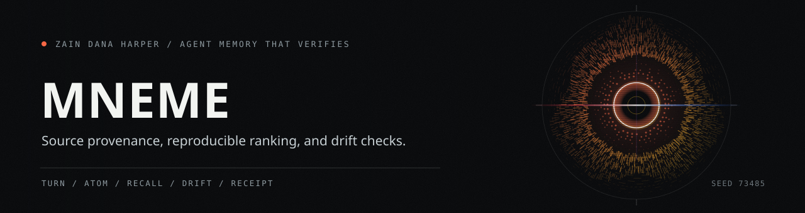

<p align="center"></p>

# mneme

> Accountable agent memory. Mneme records source provenance for stored
> memories, returns recall receipts that reproduce ranking, and detects source
> drift when checks run.

## Install

### Release wheel

The wheel provides memory, recall, drift, provenance, local-origin freshness, and MCP Crucible export/replay workflows. Forget removes a memory's raw turns and rows derived from them in the store, with a receipt naming what it cannot reach (see [Accountable forgetting](#accountable-forgetting)). Version 0.6.0 adds self-contained Windows client packages with explicit memory permissions and state-bound snapshots. The [CHANGELOG](CHANGELOG.md) lists the changes.

```bash
python -m pip install flywheel-mneme
```

`flywheel-mneme` is the HarperZ9 distribution, published with PEP 740 attestations. The bare name `mneme-memory` on PyPI belongs to an unrelated project.

To check the bytes yourself rather than trust the index, install the release wheel directly:

```bash
python -m pip install "https://github.com/HarperZ9/mneme/releases/download/v0.6.0/flywheel_mneme-0.6.0-py3-none-any.whl"
```

### Source install

For development from a source checkout:

```bash
python -m pip install -e .
```

For a non-editable install from the public source repository:

```bash
python -m pip install "flywheel-mneme @ git+https://github.com/HarperZ9/mneme.git"
```

Zero runtime dependencies · local by default · deterministic · fair-source. The
store stays on your machine; text you send through an LLM extractor, an
embedder or an MCP client goes to that model's provider under its terms.

## Why it matters

Agent memory systems need evidence for two operational questions:

- **Why did you recall *this* memory?** Mneme returns the ranked hits, component
  scores, and fusion rule so the ranking can be reproduced.
- **Is this memory still grounded in its cited source?** Mneme records source
  hashes and re-checks them to detect drift, missing sources, or unverifiable
  grounding.

Mneme stores that evidence with the memory workflow instead of leaving it as a
separate operator note.

## The 4-tier memory model

```
L0 turn      raw dialogue                 -> stored verbatim
L1 atom      atomic user facts            -> extracted, each bound to its turn
L2 scenario  scene blocks of related atoms
L3 persona   the user profile             -> synthesized, citing its atoms
```

Retrieval is hybrid: BM25 (pure Python, always on) fused with an optional
embedding channel by Reciprocal Rank Fusion, with no required embedding API.

<p align="center"></p>

## Accountability features

**A recall you can re-derive.** Every `recall` returns a receipt with the ranked
hits, their BM25 and vector scores, and the exact fusion rule. And `verify_recall`
ships the check: it re-runs the scorer over the same rows and confirms the ranking,
so a fabricated or tampered recall is caught even if its definition hash still
matches, and a store that changed no longer reproduces. The recall is auditable by a
function you can put in CI, not a claim you take on faith.

```python
from mneme import recall, verify_recall

r = recall("deploy steps", rows, strategy="hybrid", embedder=embed)
assert verify_recall(r, rows, embedder=embed)   # re-derived from the store, not trusted
```

```bash
mneme remember chat session.json --user alice
mneme recall "where does the user live" --user alice --json
# -> {"schema":"mneme.recall/1","hits":[{"memory_id":"…","bm25":2.14,"fused":…}],
#     "recheck":"mneme recall --query Q --state DB  (re-run the scorer, reproduce the ranking)"}
```

**A drift check for source changes.** `drift` re-derives every memory's
grounding against the current store: `MATCH` (source present and unchanged),
`DRIFT` (a source changed under the memory), `UNVERIFIABLE` (a source is gone).

```bash
mneme drift            # -> {"overall":"DRIFT","drifted":["…"], …}  exit 1 on drift
```

<p align="center"></p>

Two details make that verdict hard to fake. A memory row has to reproduce its own
content hash before any of its sources are looked at, which catches a direct edit
of the text, the source list, or the criterion. Each cited source is then re-hashed
from its actual fields rather than read back from the hash stored beside it,
because trusting that stored value would let someone edit the database directly,
leave a stale hash in place, and collect a `MATCH`. The check re-derives on both
sides before it will agree with itself.

The three verdicts are also ordered when they roll up across a store: any `DRIFT`
makes the whole report `DRIFT`, otherwise any `UNVERIFIABLE` makes it
`UNVERIFIABLE`, and only a clean sweep reports `MATCH`. That order fails closed. A
memory whose source has been deleted is never rounded up to a match on the grounds
that nothing contradicted it, so absence of evidence is reported as absence rather
than as agreement.

<p align="center"></p>

Nine conditions reach one of those three verdicts, and the drawing above
lists every one of them. Four resolve to `DRIFT` and four to
`UNVERIFIABLE`. Exactly one reaches `MATCH`, which is the shape of a check
that has to earn agreement rather than assume it.

**Provenance on every memory.** Every atom names the turn it came from, the
extractor, the criterion, and a content hash. The persona is not free text: it
cites its atoms, so it is drift-checkable too.

## Library

```python
from mneme import AgentMemory

mem = AgentMemory("mem.db")                       # or ":memory:"
mem.remember("chat", [{"role": "user", "text": "I live in Denver and love dark roast."}],
             user="alice")

receipt = mem.recall("coffee preference", user="alice")  # RecallReceipt, re-derivable
print(mem.drift()["overall"])                     # MATCH until a source changes
```

An embedder (`AgentMemory(..., embedder=fn)`) turns on the vector channel; an
LLM `Extractor` plugs in for richer atoms. Neither is required: the
deterministic floor works with no model and no API.

## Where your memory lives

The CLI takes `--state` before the command (`mneme --state mem.db recall …`),
and the MCP server reads `MNEME_STATE`. Without either, mneme uses `mneme.db`
in the directory it runs in, so a command run in another directory starts
another database. From 0.5.0, two commands
show where it is:

```bash
mneme status    # absolute path, default or not, files, row counts, snapshot directory
mneme doctor    # the same, plus the audit chain; exit 1 when something needs you
```

Both open the database read-only: they never create a missing database and
never write its rows (on a WAL database SQLite can create the `-wal` and
`-shm` files, as any reader does). They warn when the database sits inside a
git work tree, where, unless git ignores it, one `git add .` stages your
memory for the next commit, when an older mneme has reopened it, when replay
snapshots were left behind, and when an erase has not finished. The MCP
`mneme.doctor` tool reports the path facts without opening the database, with
your home directory written as `~`.

Replay snapshots are full copies of the database. From 0.5.0 they live in a
per-user state directory, `<LocalAppData>/mneme/snapshots` on Windows and
`$XDG_STATE_HOME/mneme/snapshots` (or `~/.local/state/mneme/snapshots`)
elsewhere, never beside the database. `mneme status` counts them. `forget`
and `mneme scrub` delete the copies of their store, and snapshots whose
process is gone are swept when a store opens for writing, when the MCP server
starts, and when a snapshot is made. A delete is a plain unlink, so the disk
blocks can keep the bytes until the file system reuses them.

Mneme keeps everything above on your machine. What leaves it is what you send:
turns given to an LLM extractor or an embedder go to that model's provider,
and so does any result an MCP client reads (recall, provenance, forget
previews). The MCP client also keeps those results in its own session history
on your machine. An erase cannot reach those copies.

Use one mneme version per database file. An older mneme that reopens a
database a newer one wrote gives the rows it writes only its own, older
guarantees. From 0.5.0 mneme records when that happened, and `mneme doctor`
reports it.

## The ecosystem: memory that traces to its source

Point mneme at an accountable intake tool ([gather](https://github.com/HarperZ9/gather),
the sibling flagship) and the provenance chain can run end to end:

```
origin ref --(intake sha256)--> mneme turn --> mneme atom --> recall
```

```bash
mneme ingest research items.json --user alice     # gather-shaped {id,text,source,ref,method,sha256}
mneme recall "where is the user based" --user alice
mneme chain <memory_id>              # -> the supplied origin ref + intake hash
mneme origin-recheck <memory_id> --allowed-root docs/
```

An agent that remembers what it researched, and can prove a recalled memory
traces to the receipt supplied by its intake tool. For supported local Gather
docs receipts, `origin-recheck` can re-read the operator-approved file under
`--allowed-root` and compare Gather's normalized decoded text hash. Legacy
receipts do not prove raw byte integrity, and unsupported refs remain
`UNVERIFIABLE` rather than silently promoted. `origin-recheck` opens Mneme state
read-only, refuses local path aliases and unsupported refs, and reports `MATCH`,
`DRIFT`, or `UNVERIFIABLE` without including source content in the report.
Any intake tool that emits the receipt shape composes; mneme never imports gather. Named-user `remember` and
Gather ingest derive source turn IDs from the user, session, supplied item/turn
ID, and for Gather the origin hash. The shared default user keeps the legacy
raw-ID namespace, except new default-user writes cannot use Mneme's reserved
internal source ID prefix.

And the loop closes at the other end. `mneme to-crucible` emits a schema-v2
[crucible](https://github.com/HarperZ9/crucible) export: each memory is a claim
paired with Mneme's source-bound drift measurement. Crucible independently
recomputes and seals `MATCH`, `DRIFT`, or `UNVERIFIABLE` from that measurement.
Each exported measurement now carries a declarative `mneme.recheck/1`
descriptor. After Crucible writes an assessment-bound replay template, Mneme
can re-read the supplied state and fill its replay pack without importing
Crucible or embedding a database path or executable command in the descriptor:

```bash
crucible recheck REGISTRY --template replay-template.json
python -c "import sqlite3; s=sqlite3.connect('file:mneme.db?mode=ro', uri=True); d=sqlite3.connect('mneme-replay-snapshot.db'); s.backup(d); d.execute('PRAGMA journal_mode=DELETE'); d.close(); s.close()"
mneme --state mneme-replay-snapshot.db replay-crucible replay-template.json --out replay-pack.json
crucible recheck REGISTRY --pack replay-pack.json --json
```

The replay command fails closed when the assessment triple, claim binding,
descriptor, original measurement contract, or target memory grounding differs.
Ordinary source drift remains a replay result (`1.0`); a missing source remains
unverifiable (`null`). Crucible still does not independently re-read Mneme's
source. The source recheck is Mneme-owned, and Crucible verifies that the
replayed measurement exactly reproduces its sealed contract.

The command consumes `crucible.replay-template/1` from a caller-owned,
quiescent, single-link rollback-journal snapshot. The example uses SQLite's
backup API to materialize one; keep that file unchanged until replay returns.

Open the source read-only when you take that snapshot, exactly as the example
does. A read-write handle on a WAL database whose writer exited without a clean
close will recover and checkpoint it: measured on Windows, that rewrote the main
file and deleted both sidecars. The read-only handle leaves the main file and
the WAL byte-identical. It can still update the `-shm` index, because SQLite
readers coordinate through shared memory. Stop source writers first when even
that is unacceptable.

Replay refuses WAL, SHM, or journal sidecars and hardlink aliases, fingerprints
the source around a consistent private SQLite backup, and reads only that
process-owned copy in immutable mode. It then verifies and preserves the compact
descriptor-only
`crucible.replay-set/1` binding, and emits `crucible.replay-pack/1`. The binding
records descriptor and skipped-row counts without disclosing descriptorless
assessment rows. Historical schema-less templates remain compatible only when
they have no replay binding and their complete measurement seal reproduces;
bound templates require the canonical schema. Read-only schema compatibility is
checked without migration, and a completed, synced pack is published atomically
without overwriting an existing path. Output paths that alias the state database
or a standard SQLite sidecar are rejected. Malformed provenance is rejected
before descriptor or pack creation. Replay does not modify the supplied
snapshot or its sidecar namespace. Changes detected while the private copy is
created fail the handoff; later source changes cannot affect that copy.

Library callers use the same contract explicitly and always close the private
snapshot owner:

```python
memory = AgentMemory(
    "mneme-replay-snapshot.db",
    read_only=True,
    immutable_snapshot=True,
)
try:
    pack = memory.replay_crucible(template)
finally:
    memory.close()
```

```
gather (intake) --> mneme (drift + replay) --> crucible (sealed recomputation)
```

The export keeps measurement and assessment separate without claiming independent
source certification.

## Accountable forgetting

From 0.5.0, `forget` erases a memory, the
turns it came from, and everything derived from them: memories that cite an
erased turn or memory, scenario and persona rows, the fact's supersession
history, and the source turns of near-duplicates that `consolidate` merged
into it. Two kinds of extra rows need your consent. Collateral rows are other
memories taken from the same turn. Duplicates are rows of the same user that
repeat an erased text whole, such as a second turn that said the same
sentence. A turn has no user of its own: it belongs to the users of the
memories that cite it, or, when none does, of the memories in its session,
and a turn in a session with no memories counts only when the erase already
touches that session. Another user's copy is never a duplicate; the receipt
reports it. The CLI shows both kinds and asks, and the library refuses both
unless you pass `allow_collateral=True`.

```bash
mneme forget <memory_id> --dry-run               # the plan: every row it would erase
mneme forget <memory_id> --reason "user asked"   # shows the plan, then asks
mneme forget <session> --session --yes           # a whole session
mneme forget <turn_id> --turn --yes              # a turn, e.g. one an old forget left
mneme audit          # -> {"entries":…,"chain_intact":true,"log":[{"op":"erase", …}]}
```

The plan shows row text and user names only on a terminal or with
`--show-text`, because a plan printed to a pipe can reach an agent's model.
`--dry-run` changes nothing, not even an older database's version stamp.

Each erased row leaves one entry in the hash-chained audit log. The entry names
a random erase ref and stores a salted commitment to the erased text. The salt
is never stored, so the entry cannot confirm a guess of what was erased.
`--emit-opening` prints the salts once, and only to a terminal: when stdout is
a pipe the command refuses before it deletes anything. The reason is stored
verbatim, so a reason is refused when it repeats a 16-character run of erased
text, holds one of its words of 8 or more characters (6 with a digit, such as
a key or a PIN), is itself a short piece of it, or names an erased row's id
or content hash. The check catches verbatim repeats only: a paraphrase or a
spaced-out spelling passes.

The rows go in one transaction with `secure_delete` on. After the commit,
mneme removes this store's replay snapshots, vacuums the file, and scans the
database files and known copies for the erased bytes. A refused erase (a stale
plan, a refused reason) changes nothing, snapshots included.

The receipt has a `status` and a list of `findings`. `findings` holds a code
for each check that did not pass, and `status` is `erased` only when the list
is empty. Otherwise `status` is the first that applies of
`erased_residue_found`, `erased_copies_remain`, `incomplete` and
`erased_sources_kept`. A failure after the commit gives `erased_unverified`
instead: the rows are gone, but the receipt could not be built. Each finding
maps to one status:

| Finding | Status | Meaning |
|---|---|---|
| `rows_present` | `erased_residue_found` | a planned row is still in the store |
| `scrub_incomplete` | `erased_residue_found` | the WAL checkpoint or the VACUUM did not finish |
| `snapshot_removal_failed` | `erased_residue_found` | a replay snapshot of this store could not be removed or listed |
| `scan_hits` | `erased_residue_found` | the database files still hold 16 or more bytes of erased text that no kept row explains |
| `kept_rows_repeat_erased_text` | `erased_residue_found` | a kept row, such as another user's, repeats an erased text whole |
| `kept_rows_contain_short_text` | `erased_residue_found` | a kept row holds an erased text of 8 to 15 characters inside longer text |
| `kept_rows_share_erased_run` | `erased_residue_found` | a kept row shares a 16-character run with a longer erased text |
| `audit_reasons_quote_erased_text` | `erased_residue_found` | an audit reason quotes erased text or holds one of its tokens with a digit |
| `unresolved_merged_sources` | `erased_residue_found` | an older mneme merged a near-duplicate away without a link, so its source turn may remain |
| `copies_hold_erased_text` | `erased_copies_remain` | a legacy temp snapshot or another store's snapshot holds erased text |
| `snapshot_removed_while_live` | `erased_copies_remain` | a snapshot was removed while its process ran, which can keep reading it on POSIX |
| `scan_incomplete` | `incomplete` | a store file could not be read |
| `copies_unchecked` | `incomplete` | a known copy could not be read, or is over the 1 GiB cap |
| `sources_kept` | `erased_sources_kept` | you kept the source turns (`--keep-sources`) |
| `post_commit_failure` | `erased_unverified` | a step after the commit raised |

The CLI exits 3 for every status except `erased` and `erased_sources_kept`.
While a scrub step or the snapshot removal has not finished, and after
`erased_unverified`, the store keeps an "erase not finished" marker, and
`mneme status` and `mneme doctor` warn until `mneme scrub` finishes the work.

The byte scan looks for runs of 16 bytes or more. A text under 16 bytes gets
structural checks only: its rows are gone, no kept row repeats it whole, and,
when it has 8 or more characters, no kept row holds it as a word. For such a
text `erased` means the rows are gone, not that a byte scan found nothing.

The receipt also names what an erase cannot remove. Audit rows written
earlier still name the erased rows by content-derived id, and such an id
confirms a guessed text when its source turn id is known. The disk blocks
SQLite released, and those of deleted snapshots, can hold old bytes until they
are reused. Exports, backups, other copies of the database file, text already
sent to a model provider, and the MCP client's own session history, which
keeps every result it read, are out of its reach.

`update` edits a memory's text while keeping its provenance, and `supersede`
closes a fact while keeping it for history. From schema 5 their audit entries
hold salted commitments to the old and new versions instead of plain hashes.
The salts sit in the store under the memory they describe, so the history can
be checked while the memory lives. An erase deletes the salts with the rows,
and the commitments then open to nothing. The entries keep the memory's
content-derived id, which the receipt counts. Entries written before schema 5
keep plain hashes, and the erase receipt counts them. Tamper any entry and the
chain breaks.

In 0.4.2 and earlier, `forget` deleted the memory row only and left the raw
turn in the store. `mneme status` counts those forget entries and the turns no
memory cites, and `mneme forget <turn_id> --turn` erases such a turn.

## Agents plug in over MCP

```bash
mneme mcp          # JSON-RPC 2.0 over stdio; MNEME_STATE points at the DB
```

The wheel exposes the MCP memory, recall, drift, provenance, origin recheck, forget, audit, status, doctor, Crucible export, and Crucible replay tools. The client package starts with the restricted export profile; its memory-change setup option grants the full memory workflow.

From 0.5.0, `mneme.forget` takes two steps. A call with only `memory_id` returns
the plan (targets, row ids and counts, the number of users but not their names,
with text previews only when `include_previews` is set) and deletes nothing. A
second call with `confirm_plan_sha256` applies exactly that plan and returns
the receipt, without the commitment openings or the plan digest. When the plan
lists collateral or duplicate rows, the second call also needs
`allow_collateral: true`. The
model that asked for the plan can send the digest too, so a host that launches
mneme for an agent should require an owner-granted step for this tool.

From 0.5.0, `mneme.doctor` also returns the database's absolute path (home
written as `~`), whether it came from `MNEME_STATE`, the replay snapshot
directory and any warnings, without opening the database.

MCP tools `mneme.to_crucible` and `mneme.replay_crucible` reuse the same replay library boundaries as the CLI. A recall
through MCP returns the same re-derivable receipt, so the agent (or its operator)
can see and re-check why a memory was surfaced; the accountability travels with
the tool result. `mneme.to_crucible` returns the existing
`mneme.crucible-export/2` object from the server-bound `MNEME_STATE`; MCP
callers must pass either `user` to select one tenant inside that configured
state, or `all_users: true` to deliberately export every tenant visible to the
server. Optional `session` filters must be non-empty strings; `layer` is limited
to `L1`, `L2`, or `L3`. The `user` value is a selector, not an authentication
boundary; the host still owns which state DB the server may open. Crucible
export and replay fail when `MNEME_STATE` is unset or empty. `mneme.replay_crucible`
consumes a decoded `crucible.replay-template/1` object and returns
`crucible.replay-pack/1` from the same explicitly configured state. State paths
and executable commands stay out of the untrusted recheck descriptors. All-row
templates (`skipped_count: 0`) are checked against the assessment measurement
seal. Mixed templates with skipped rows are refused until the template carries a
verifier-enforced full denominator that binds the disclosed descriptors, skipped
count, and undisclosed rows to the assessment; Mneme cannot authenticate
undisclosed rows from an external assessment from a caller-recomputed binding
alone.

## Benchmark you can re-run

Token-reduction benchmarks are more useful when paired with answer-retention
checks. Mneme reports both for the included benchmark.

```bash
mneme bench
# token_reduction: 76.6%   (full history 125 tok -> avg recalled 29 tok)
# answer_recall:   100%    (5 probes, every needed fact survived the reduction)
```

The included reduction is reported **alongside** answer recall, so a run that
forgets required answers is visible in the result. The receipt carries the
per-probe detail and the exact token estimator, so a third party can re-run the
measurement over the same conversation and compare the number. Point it at your
own conversation with `--turns convo.json --probes probes.json`.

## Scenarios (L2)

```bash
mneme scenarios alice     # cluster the session's atoms into scene blocks
```

Atoms sharing a theme cluster deterministically into L2 scenarios; each scenario
cites its atoms, so it is drift-checkable too (a scenario whose atom is gone is
`UNVERIFIABLE`, never silently kept).

## Guarantees

- **Zero runtime dependencies** (stdlib `sqlite3`). `pytest` is the only dev dep.
- **Deterministic core.** Memory rows, their hashes and default rankings are
  derived from the supplied turns, so the same input rebuilds the same
  memories. Some values are random on purpose: the store id that names the
  replay snapshot directory, the refs and salted commitments in the audit
  entries an erase writes, and the salted commitments in update, supersede and
  row-level forget entries. The erase entries cannot confirm a guess of what
  was erased. The other entries keep a content-derived memory id, which can,
  and the erase receipt counts them.
- **Tests are the contract.** The core workflows above have regression coverage
  with false-success controls for recall, drift, audit, and ingestion.

## Development

For a local development checkout:

```bash
python -m pip install -e ".[test]"
python -m pytest
```

Use synthetic SQLite state for tests and examples. `mneme mcp` reads `MNEME_STATE`; do not point examples, demos, or interop checks at a live user database. Release publication remains gated by `DELIVERY.md`, CI, version/tag alignment, and explicit operator action.

## License

Mneme is fair-source: open to read, run, and build on, with commercial use reserved so the project can fund its own development. See [LICENSE](LICENSE).

## What this believes

This tool is one lane of a family that holds a single belief steady across
every surface: knowledge open to anyone who can attain the means; acceptance
decided by external checks, never reputation; every result re-runnable;
honest nulls first-class; ownership earned by comprehension; learning woven
into the work. The full text lives in [CREDO.md](CREDO.md).
The long form of this belief: [The Unbundling](https://github.com/HarperZ9/flywheel/blob/fix/release-model-identity/docs/essays/2026-07-13-the-unbundling.md).

---

**[Zentropy Labs](https://github.com/ZentropyLabs-ai)** · order out of entropy. An independent lab building evidence-first tools that leave a re-checkable artifact behind. Built by Zain Dana Harper in Seattle. The full workbench is at [Project Telos](https://harperz9.github.io).

## 0.6.0 local client distribution candidate

The additional [client package](client-plugin/README.md) includes portable plugin metadata and a Windows x64 MCPB/ZIP build. The source version is 0.6.0; these client packages remain unpublished candidates. Existing release installation commands above retain their released version. Native packages carry their Python runtime. No publisher backend is required.
